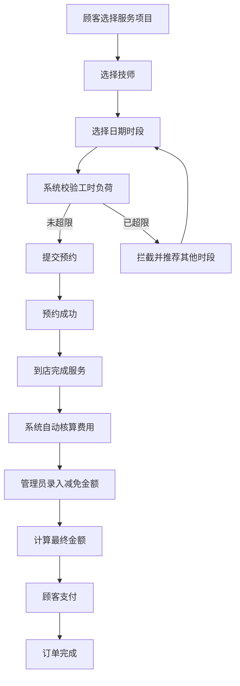

## 1. 产品概述

美甲美睫门店预约工时计费系统，面向顾客与门店技师双向开放使用。顾客可线上挑选服务项目并预约时段，后端实时监控技师工时负荷，完成服务后自动核算订单费用，支持管理人员调整收款金额。

- **主要用途**：实现美甲美睫门店的数字化预约管理、工时监控、智能计费
- **目标用户**：门店顾客、门店技师、门店管理人员
- **市场价值**：提升门店运营效率，优化顾客预约体验，实现工时精细化管理

## 2. 核心功能

### 2.1 用户角色

| 角色 | 登录方式 | 核心权限 |
|------|----------|----------|
| 顾客 | 手机号登录 | 浏览服务项目、预约服务、查看预约记录、支付订单 |
| 技师 | 工号登录 | 查看个人排班、管理预约状态、查看服务记录 |
| 管理员 | 账号密码登录 | 门店配置、技师管理、订单管理、金额减免、数据统计 |

### 2.2 功能模块

1. **首页**：服务项目展示、热门推荐、快速预约入口
2. **预约页面**：服务选择、技师选择、日期时段选择、预约确认
3. **订单管理**：订单列表、订单详情、费用核算、金额调整
4. **技师管理**：技师信息、工时配置、排班查看、负荷监控
5. **门店配置**：工时上限设置、服务项目管理、价格标准维护

### 2.3 页面详情

| 页面名称 | 模块名称 | 功能描述 |
|---------|----------|----------|
| 首页 | 服务项目展示 | 分类展示美甲、美睫细分项目，显示价格和标准工时 |
| 首页 | 热门推荐 | 展示热门服务项目，支持一键预约 |
| 预约页面 | 服务选择 | 多选服务项目，显示累计工时和预估价格 |
| 预约页面 | 技师选择 | 展示技师列表及当日负荷状态，支持筛选 |
| 预约页面 | 时段选择 | 日历视图选择日期，时段列表显示空闲/忙碌状态 |
| 预约页面 | 预约确认 | 显示预约详情，提交前进行工时校验 |
| 订单详情页 | 费用核算 | 根据服务项目自动计算总价，支持减免金额录入 |
| 技师详情页 | 工时展示 | 展示技师当日预约累计工时，可视化负荷状态 |
| 门店配置页 | 负荷设置 | 设置技师单日工时负荷上限 |

## 3. 核心流程

### 3.1 顾客预约流程

顾客浏览服务项目 → 选择美甲/美睫具体项目 → 选择心仪技师 → 选择到店日期和时段 → 系统实时校验技师当日累计工时 → 若超出负荷上限则拦截并推荐其他空闲时段 → 确认预约信息 → 提交订单 → 预约成功

### 3.2 订单结算流程

顾客到店完成服务 → 系统根据所选项目标准工时×单价自动核算总价 → 管理人员可手动录入小额减免金额 → 计算最终应收金额 → 顾客确认支付 → 订单完成

### 3.3 业务流程图

## 4. 用户界面设计

### 4.1 设计风格

- **主色调**：玫瑰粉 (#F8BBD0) + 深紫色 (#7B1FA2)，营造优雅柔美的美甲店氛围
- **辅助色**：香槟金 (#FFD54F) 作为强调色，用于重要按钮和状态提示
- **背景色**：奶白色 (#FFF8F0) 主背景，浅粉色 (#FCE4EC) 卡片背景
- **按钮风格**：圆润胶囊型按钮，柔和渐变，悬停时微缩放动效
- **字体**：标题使用 "Noto Serif SC" 衬线字体，正文使用 "Noto Sans SC" 无衬线字体
- **布局风格**：卡片式布局，柔和阴影，圆角设计，精致分割线
- **图标风格**：线性简约图标，搭配柔和色彩，统一使用24px尺寸

### 4.2 页面设计概述

| 页面名称 | 模块名称 | UI元素 |
|---------|----------|--------|
| 首页 | 服务项目展示 | 卡片网格布局，服务图片、名称、价格、工时标签，悬停微动效 |
| 预约页面 | 时段选择 | 日历组件支持日期切换，时段按钮使用颜色区分空闲/忙碌/已约满 |
| 预约页面 | 工时监控 | 进度条可视化展示技师当日已用工时，超限状态红色警示 |
| 订单详情页 | 费用明细 | 清单式展示各项费用，减免金额输入框带有人民币符号前缀 |
| 技师详情页 | 负荷展示 | 环形进度图展示工时使用率，不同阈值显示不同颜色 |

### 4.3 响应式设计

- **设计优先级**：Desktop-first，移动端自适应
- **断点设置**：1200px（桌面端）、768px（平板）、480px（手机）
- **移动端优化**：底部导航栏，卡片单列布局，大尺寸点击区域，触控优化
- **触控交互**：按钮最小高度48px，表单元素足够间距，防止误触

### 4.4 交互动效

- **页面切换**：淡入淡出过渡，滑动动画
- **按钮交互**：悬停缩放1.05倍，点击反馈涟漪效果
- **表单验证**：错误状态抖动动画，成功状态绿色对勾动画
- **工时超限提示**：模态框弹出动画，推荐列表渐入展示
- **数据加载**：骨架屏占位，内容渐入加载
