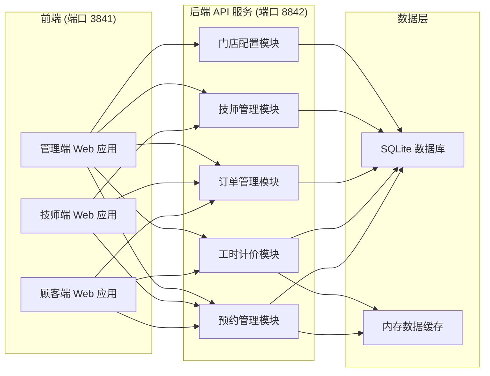
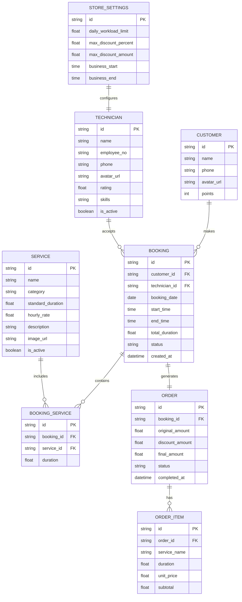

## 1. 架构设计



## 2. 技术选型

### 2.1 前端技术栈
- **框架**: React@18 + TypeScript
- **构建工具**: Vite@5
- **样式方案**: TailwindCSS@3
- **路由管理**: React Router DOM@6
- **状态管理**: Zustand
- **HTTP 客户端**: Axios
- **UI 组件库**: Ant Design@5 + 自定义主题
- **图标库**: Lucide React
- **动画库**: Framer Motion

### 2.2 后端技术栈
- **运行环境**: Node.js@20
- **框架**: Express@4
- **语言**: TypeScript
- **ORM**: Prisma@5
- **数据库**: SQLite（开发环境）
- **验证库**: Zod
- **CORS**: cors 中间件

### 2.3 端口配置
- **前端服务端口**: 3841
- **后端 API 端口**: 8842

## 3. 目录结构

### 3.1 前端目录 (client/)
```
client/
├── src/
│   ├── components/          # 公共组件
│   ├── pages/              # 页面组件
│   │   ├── customer/       # 顾客端页面
│   │   ├── technician/     # 技师端页面
│   │   └── admin/          # 管理端页面
│   ├── store/              # 状态管理
│   ├── services/           # API 服务
│   ├── types/              # TypeScript 类型定义
│   ├── utils/              # 工具函数
│   ├── hooks/              # 自定义 Hooks
│   ├── styles/             # 全局样式
│   ├── App.tsx
│   └── main.tsx
├── public/
├── package.json
├── vite.config.ts
└── tsconfig.json
```

### 3.2 后端目录 (server/)
```
server/
├── src/
│   ├── controllers/        # 控制器层
│   ├── services/           # 业务逻辑层
│   ├── repositories/       # 数据访问层
│   ├── routes/             # 路由定义
│   ├── middleware/         # 中间件
│   ├── types/              # 类型定义
│   ├── utils/              # 工具函数
│   ├── prisma/             # Prisma 配置
│   │   └── schema.prisma   # 数据模型
│   └── index.ts            # 入口文件
├── package.json
├── tsconfig.json
└── .env
```

## 4. 路由定义

### 4.1 前端路由

| 路由路径 | 页面名称 | 所属端 |
|---------|----------|--------|
| / | 首页 - 服务项目展示 | 顾客端 |
| /booking | 预约页面 | 顾客端 |
| /orders | 我的预约 | 顾客端 |
| /orders/:id | 订单详情 | 顾客端 |
| /technician | 技师首页 | 技师端 |
| /technician/schedule | 排班查看 | 技师端 |
| /admin | 管理后台首页 | 管理端 |
| /admin/orders | 订单管理 | 管理端 |
| /admin/technicians | 技师管理 | 管理端 |
| /admin/services | 服务项目管理 | 管理端 |
| /admin/settings | 门店配置 | 管理端 |

### 4.2 后端 API 路由

| 方法 | 路由 | 模块 | 功能描述 |
|------|------|------|----------|
| GET | /api/services | 服务模块 | 获取服务项目列表 |
| GET | /api/services/:id | 服务模块 | 获取服务详情 |
| GET | /api/technicians | 技师模块 | 获取技师列表 |
| GET | /api/technicians/:id | 技师模块 | 获取技师详情 |
| GET | /api/technicians/:id/workload | 工时模块 | 获取技师指定日期工时负荷 |
| GET | /api/technicians/:id/available-slots | 预约模块 | 获取技师指定日期可用时段 |
| POST | /api/bookings | 预约模块 | 提交预约 |
| GET | /api/bookings | 预约模块 | 获取预约列表 |
| GET | /api/bookings/:id | 预约模块 | 获取预约详情 |
| PUT | /api/bookings/:id/status | 预约模块 | 更新预约状态 |
| GET | /api/orders | 订单模块 | 获取订单列表 |
| GET | /api/orders/:id | 订单模块 | 获取订单详情 |
| POST | /api/orders/:id/calculate | 计价模块 | 核算订单费用 |
| PUT | /api/orders/:id/discount | 订单模块 | 录入减免金额 |
| PUT | /api/orders/:id/complete | 订单模块 | 完成订单 |
| GET | /api/settings/workload-limit | 配置模块 | 获取工时上限配置 |
| PUT | /api/settings/workload-limit | 配置模块 | 更新工时上限配置 |

## 5. 核心业务逻辑

### 5.1 工时负荷校验算法
```typescript
// 输入：技师ID、预约日期、新预约项目总工时
// 输出：{ isOverloaded: boolean, currentWorkload: number, maxLimit: number, availableSlots: Slot[] }
function checkTechnicianWorkload(
  technicianId: string,
  bookingDate: Date,
  newBookingDuration: number
): WorkloadCheckResult {
  // 1. 获取门店设置的单日工时上限（默认 8 小时）
  const maxWorkload = getWorkloadLimit();
  
  // 2. 查询该技师当日已确认的所有预约
  const existingBookings = getConfirmedBookings(technicianId, bookingDate);
  
  // 3. 计算已预约累计工时
  const currentWorkload = existingBookings.reduce(
    (sum, booking) => sum + booking.totalDuration,
    0
  );
  
  // 4. 判断是否超限
  const isOverloaded = currentWorkload + newBookingDuration > maxWorkload;
  
  // 5. 如果超限，查询其他技师的可用时段
  const availableSlots = isOverloaded 
    ? findAvailableSlots(bookingDate, newBookingDuration)
    : [];
  
  return {
    isOverloaded,
    currentWorkload,
    maxLimit: maxWorkload,
    availableSlots
  };
}
```

### 5.2 订单计价算法
```typescript
// 输入：订单ID、减免金额（可选）
// 输出：{ originalAmount, discountAmount, finalAmount, detailItems: PriceItem[] }
function calculateOrderPrice(
  orderId: string,
  discountAmount: number = 0
): PriceCalculationResult {
  // 1. 获取订单关联的服务项目
  const order = getOrderWithServices(orderId);
  
  // 2. 计算每项服务费用 = 标准工时 × 工时单价
  const detailItems = order.services.map(service => ({
    serviceName: service.name,
    duration: service.standardDuration,
    unitPrice: service.hourlyRate,
    subtotal: service.standardDuration * service.hourlyRate
  }));
  
  // 3. 计算原始总价
  const originalAmount = detailItems.reduce(
    (sum, item) => sum + item.subtotal,
    0
  );
  
  // 4. 校验减免金额（不超过原始总价的 10% 或 100 元，取较小值）
  const maxDiscount = Math.min(originalAmount * 0.1, 100);
  const validDiscount = Math.min(Math.max(0, discountAmount), maxDiscount);
  
  // 5. 计算最终金额
  const finalAmount = Math.max(0, originalAmount - validDiscount);
  
  return {
    originalAmount,
    discountAmount: validDiscount,
    finalAmount,
    detailItems
  };
}
```

### 5.3 可用时段查询算法
```typescript
// 输入：日期、所需时长
// 输出：符合条件的可用时段列表
function findAvailableSlots(
  date: Date,
  requiredDuration: number
): AvailableSlot[] {
  // 1. 定义营业时间（10:00 - 20:00）
  const businessHours = { start: 10, end: 20 };
  
  // 2. 时间粒度 30 分钟
  const timeSlot = 30;
  
  // 3. 遍历所有技师
  return getAllTechnicians().map(technician => {
    // 4. 获取该技师当日已有预约
    const bookings = getConfirmedBookings(technician.id, date);
    
    // 5. 计算可用时段
    const slots = calculateAvailableTimeSlots(
      businessHours,
      timeSlot,
      bookings,
      requiredDuration
    );
    
    return {
      technicianId: technician.id,
      technicianName: technician.name,
      slots
    };
  }).filter(item => item.slots.length > 0);
}
```

## 6. 数据模型

### 6.1 ER 图



### 6.2 初始化数据

```sql
-- 门店配置
INSERT INTO store_settings (id, daily_workload_limit, max_discount_percent, max_discount_amount, business_start, business_end)
VALUES ('default', 8.0, 10.0, 100.0, '10:00', '20:00');

-- 技师数据
INSERT INTO technician (id, name, employee_no, phone, avatar_url, rating, skills, is_active) VALUES
('tech_001', '李美美', 'T001', '13800138001', '/avatars/tech1.jpg', 4.9, '美甲,美睫,手足护理', true),
('tech_002', '王芳芳', 'T002', '13800138002', '/avatars/tech2.jpg', 4.8, '美甲,彩绘,光疗甲', true),
('tech_003', '张婷婷', 'T003', '13800138003', '/avatars/tech3.jpg', 4.7, '美睫,纹绣,孕睫术', true);

-- 服务项目数据
INSERT INTO service (id, name, category, standard_duration, hourly_rate, description, image_url, is_active) VALUES
-- 美甲类
('svc_001', '基础美甲', 'manicure', 1.0, 128, '指甲修剪、去死皮、抛光、涂纯色甲油', '/images/manicure-basic.jpg', true),
('svc_002', '光疗甲', 'manicure', 1.5, 258, '持久光疗胶，色泽饱满，保持4-6周', '/images/manicure-gel.jpg', true),
('svc_003', '法式美甲', 'manicure', 1.5, 198, '经典法式微笑线，优雅大方', '/images/manicure-french.jpg', true),
('svc_004', '美甲彩绘', 'manicure', 2.0, 328, '手绘图案、钻饰搭配，个性定制', '/images/manicure-art.jpg', true),
('svc_005', '足部美甲', 'manicure', 1.5, 228, '足部指甲修剪、去死皮、涂甲油', '/images/manicure-pedicure.jpg', true),
-- 美睫类
('svc_006', '自然款美睫', 'eyelash', 1.5, 298, '80-100根/眼，自然纤长', '/images/eyelash-natural.jpg', true),
('svc_007', '浓密款美睫', 'eyelash', 2.0, 398, '120-140根/眼，卷翘浓密', '/images/eyelash-voluminous.jpg', true),
('svc_008', '开花美睫', 'eyelash', 2.5, 498, '3D开花技术，蓬松自然', '/images/eyelash-flower.jpg', true),
('svc_009', '睫毛修复', 'eyelash', 1.0, 128, '修补掉落睫毛，保持完美效果', '/images/eyelash-fix.jpg', true),
-- 护理类
('svc_010', '手部护理', 'care', 1.0, 168, '去角质、手膜、按摩，滋润保湿', '/images/care-hand.jpg', true),
('svc_011', '足部护理', 'care', 1.5, 228, '去角质、足膜、按摩，舒缓疲劳', '/images/care-foot.jpg', true);
```

## 7. 测试场景设计

为了验证核心业务逻辑，设计以下测试场景：

### 7.1 工时负荷校验场景

| 场景编号 | 场景描述 | 操作步骤 | 预期结果 |
|---------|----------|----------|----------|
| TC01 | 正常预约，工时未超限 | 技师A当日已预约5小时，新预约2小时 | 预约提交成功，累计工时7小时 |
| TC02 | 工时超限，拦截预约 | 技师A当日已预约7小时，新预约2小时 | 预约被拦截，提示"该技师当日工时已达上限"，并推荐其他技师可用时段 |
| TC03 | 刚好达到上限 | 技师A当日已预约7.5小时，新预约0.5小时 | 预约提交成功，累计工时8小时（达到上限） |
| TC04 | 修改门店工时上限 | 将上限从8小时改为10小时，然后预约 | 超限阈值自动更新为10小时 |
| TC05 | 跨日预约不影响 | 技师A昨日已满负荷，今日预约 | 今日工时从零开始计算，不影响预约 |

### 7.2 订单计价场景

| 场景编号 | 场景描述 | 操作步骤 | 预期结果 |
|---------|----------|----------|----------|
| TC06 | 单个服务计价 | 选择"基础美甲"服务（1小时×128元） | 原始总价128元，最终金额128元 |
| TC07 | 多个服务合计 | 选择"基础美甲"+"自然款美睫"（1×128 + 1.5×298） | 原始总价128+447=575元 |
| TC08 | 正常减免金额 | 订单总价500元，录入减免30元 | 减免30元，最终金额470元 |
| TC09 | 减免超限（百分比） | 订单总价500元，尝试减免100元（20%） | 最多减免50元（10%），最终金额450元 |
| TC10 | 减免超限（金额） | 订单总价2000元，尝试减免300元 | 最多减免100元（金额上限），最终金额1900元 |
| TC11 | 减免金额为0 | 订单总价500元，减免0元 | 最终金额500元，无减免 |
| TC12 | 负数减免金额 | 输入-50元减免 | 系统自动修正为0元，不支持负数减免 |

### 7.3 时段选择场景

| 场景编号 | 场景描述 | 操作步骤 | 预期结果 |
|---------|----------|----------|----------|
| TC13 | 空闲时段可选 | 技师A 14:00-15:00 无预约 | 该时段显示为绿色，可点击选择 |
| TC14 | 已预约时段不可选 | 技师A 14:00-15:00 已有预约 | 该时段显示为灰色，不可点击 |
| TC15 | 跨时段预约 | 选择14:00开始，时长1.5小时 | 14:00-15:30 时间段被占用 |
| TC16 | 非营业时间 | 选择09:00时段 | 不显示非营业时间选项 |
| TC17 | 时段冲突检测 | 同一技师同一时段重复预约 | 系统检测冲突，阻止提交 |

## 8. 项目脚本

### 8.1 package.json 脚本

```json
{
  "scripts": {
    "dev:client": "cd client && vite --port 3841",
    "dev:server": "cd server && ts-node-dev src/index.ts",
    "dev": "concurrently \"npm run dev:server\" \"npm run dev:client\"",
    "build:client": "cd client && tsc && vite build",
    "build:server": "cd server && tsc",
    "build": "npm run build:server && npm run build:client",
    "start": "cd server && node dist/index.js",
    "seed": "cd server && ts-node prisma/seed.ts",
    "test:scenarios": "cd server && ts-node src/utils/test-scenarios.ts"
  }
}
```
